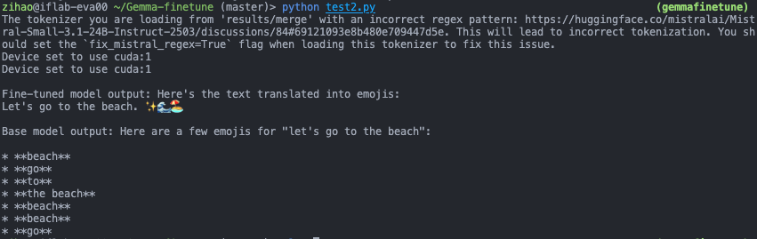

# Gemma Finetune

Fine-tune the Gemma-270M model to enable it to translate textual language into emojis.

## setup
```
conda create -n gemmafinetune python==3.10
conda activate gemmafinetune
pip install -r requirements.txt
```

## Start

Step 1: Fine-tune the model

```
bash script/lora.sh
```

Step 2: Merge the LoRA adapter and the fine-tuned model

```
bash script/merge.sh
```

Step 3: Test the performance

```
bash seript/chat_test.sh
```

## Example



## Model
We realese our [fine-tuned model](https://huggingface.co/zhengzihaoPKU/gemma-3-270m-it-emoji-finetune) in Huggingface Hub.

## Test Results
LoRA:

QLoRA:

ALoRA:

## Key Notes
1. The versions of several key installation packages are listed as follows:

    ```
    pyarrow == 20.0.0, peft == 0.17.0, transformers == 4.57.0
    ```

2. The model must be "instruct" version.

## Reference
[Google Colab](https://colab.research.google.com/github/google-gemini/gemma-cookbook/blob/main/Demos/Emoji-Gemma-on-Web/resources/Fine_tune_Gemma_3_270M_for_emoji_generation.ipynb#scrollTo=VbeyDcpwi4IB)

[Zhihu](https://zhuanlan.zhihu.com/p/1985797288883405826)